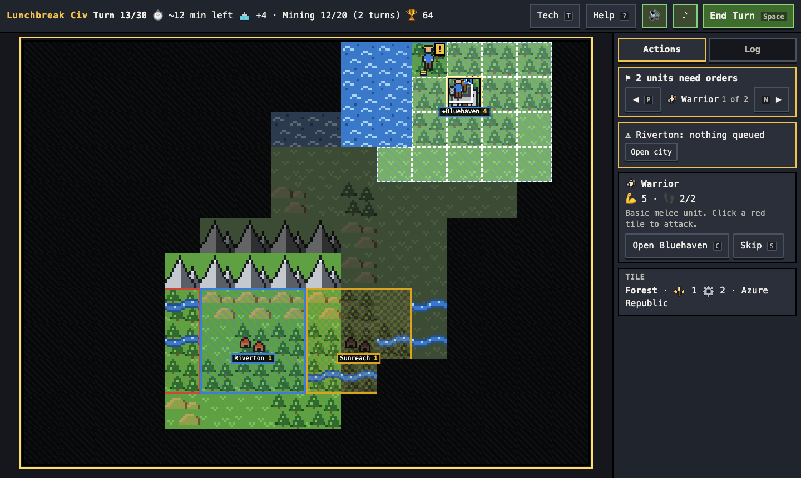
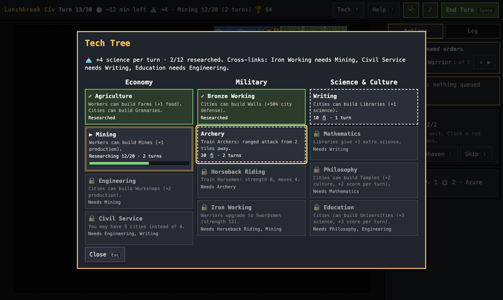

# Lunchbreak Civ

**A complete Civilization-style 4X strategy game you can finish on your lunch break.**

Explore, expand, research, and outscore two AI rivals in 30 turns, about 20 minutes. Pixel art, synthesized chiptune audio, full keyboard play, and auto-save for when lunch gets interrupted.

[](https://github.com/egirardo/lunchbreak-civ/actions/workflows/deploy.yml)

### ▶ [Play it in your browser](https://egirardo.github.io/lunchbreak-civ/)

No install or account needed. Your game saves in your browser.



## Features

- **A full 4X game in 20 minutes.** 30 turns, a 16×12 map, 1 player vs 2 AI opponents, with a hard turn cap so it always ends.
- **Four ways to win.** Highest score at turn 30, or an instant Domination, Science, or Culture victory.
- **Small, readable tech tree.** 12 techs in three branches (Economy, Military, Science & Culture), all visible from the start.
- **AI opponents** that expand, research, defend, and attack the weakest rival. Some pursue culture; all respond when a rival nears a culture win. Easy and Normal difficulty.
- **Built for interruptions.** Auto-saves every turn, shows a "welcome back" summary, and only counts play time while the tab is visible.
- **Designed for one hand and a sandwich.** An orders bar flips through units that need orders, warnings flag idle cities and research, and Space ends the turn.
- **Accessible.** Full keyboard play, screen-reader labels and announcements, and colour never used alone: territories, owners, and markers also use patterns and shapes. Respects reduced motion.
- **End-of-game stats.** Play time, battles, units, cities and techs, plus a one-click summary for playtest notes.
- **Original pixel art and audio.** Every sprite is hand-built 16×16 pixel art, and all sound and music are synthesized with the Web Audio API. No external assets.



## How to play

Each turn you can move units, choose what your cities build, pick research, and set city focus. Then end your turn and the AIs move.

- **Food** grows cities, **production** builds units and buildings, and **science** unlocks techs.
- Found up to 4 cities (5 with Civil Service). Each works the best tiles around it.
- Combat is instant: higher strength wins, ties go to the defender, and attacking with a friendly unit adjacent to the target adds +1.
- Capturing a rival's capital eliminates them.

The full guide, with a legend of every symbol, is in the game under **Help (?)** and in [`docs/how-to-play.md`](docs/how-to-play.md).

### Controls

| Key | Action |
|---|---|
| Click / Arrow keys + Enter | Select, move, or attack |
| Space | End turn |
| N / P | Next / previous unit that needs orders |
| S | Skip unit |
| F | Found city (Settler) |
| G / M | Build Farm / Mine (Worker) |
| C | Open city |
| T | Tech tree |
| L | Switch Actions / Log tab |
| ? | Help |
| Esc | Close / cancel |

## Tech stack

- **TypeScript** (strict) + **Vite**, with no runtime dependencies
- **DOM-based rendering**: the map is a grid of pixel-art sprites, so it stays screen-reader accessible
- **Vitest** for game logic, including full 30-turn AI-vs-AI simulations
- **localStorage** for saves; no backend
- **GitHub Actions** lints, tests, builds, and deploys to **GitHub Pages** on every push to `master`

## Running locally

Requires Node.js 20.19+ or 22.12+.

```bash
npm install       # install dependencies
npm run dev       # start the dev server (http://localhost:5173)
npm test          # run the test suite
npm run lint      # ESLint + type check
npm run build     # production build into dist/
```

## Project structure

```
src/
  core/      Pure game logic: state, rules, map generation, AI. No DOM; fully tested.
  data/      Game content as data: units, buildings, techs, terrain, balance constants.
  ui/        Rendering, input, panels, sprites, audio.
  storage/   Save/load to localStorage.
docs/
  how-to-play.md   Player guide (also shown in-game)
  techs.md         Tech tree design
  balance.md       Playtest log and every balance change, with the data behind it
  credits.md       Art and audio credits
```

The architecture keeps game rules separate from the UI: `core/` never imports from `ui/`, game state is a single serializable object, all randomness is seeded so games are reproducible, and units, techs, and buildings live in `data/` so balancing doesn't require code changes. [`CLAUDE.md`](CLAUDE.md) is the design document and the source of truth for the rules.

## Balancing

All numbers are starting points that get tuned through playtesting and simulation. Every change is logged in [`docs/balance.md`](docs/balance.md) with the observation that motivated it and before/after results. To contribute a playtest, finish a game, press **Copy summary** on the end screen, and add it there with your impressions.

## Credits

All art is original and released under CC0, and all audio is synthesized at runtime. See [`docs/credits.md`](docs/credits.md).

## License

[MIT](LICENSE) © 2026 Elsa Girardo. The pixel art is additionally released under CC0 (see credits).
